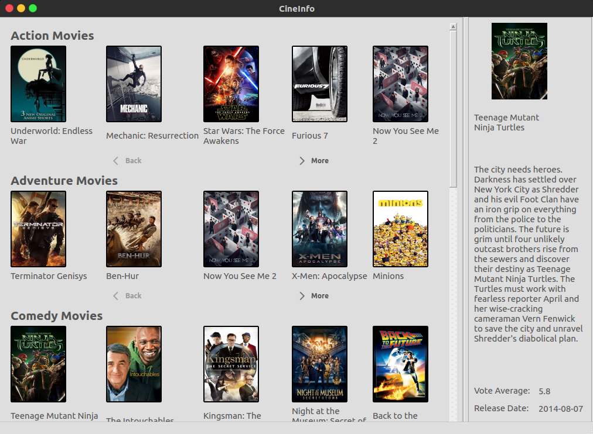

# CineInfo
> This application provides information about movies. The movies are divided into 8 categories: action, adventure,
> comedy, romance, drama, crime, horror, science fiction.

## Installation
* Clone repository: https://github.com/andrepgsilva/CineInfo.git
* Install Python3
* Install PyQt4. More information: https://www.riverbankcomputing.com/software/pyqt/download
* Install all dependencies, using: pip install -r requirements.tx
* Run the application, using: python3 main.py

## Overview of application

